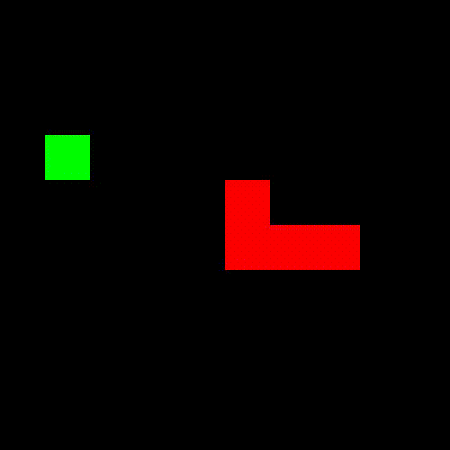

# Notable A.I. and Machine Learning Projects

## Table of Contents

- [Notable A.I. and Machine Learning Projects](#notable-ai-and-machine-learning-projects)
  - [Table of Contents](#table-of-contents)
  - [Papers (Unpublished Manuscripts)](#papers-unpublished-manuscripts)
  - [Professional Projects](#professional-projects)
  - [Academic Projects](#academic-projects)
  - [Side projects](#side-projects)

## Papers (Unpublished Manuscripts)
 
<ol>
    <li>Towards Neural Ranking for Mixed-Initiative Conversational Search</li>
     
    <ul>
        <li><strong>Abstract</strong>: Recent research has shown that integrating clarifying questions and answers into ranking models offers the potential  to better understand users’ information needs and improve document ranking. However, previous approaches only used naive ranking models (i.e. QL and BM25) so far and neural rankers remain unexplored. At the same time, neural ranking models dominate leaderboards for single-shot query tasks  and bring interesting features that should also be advanta- geous in a conversational setup. In this work we explore  how neural rankers can be extended to effectively represent clarifying question and answer in addition to the initial  user query. To this end, we first try to extend conventional neural ranking models ConvKNRM and PACRR by naively aggregating FastText word embeddings. We then investigate whether contextualized word embeddings given by BERT are able to incorporate clarifying questions and answers more  effectively and outperform these baselines. Lastly, we ana- lyze how our models perform on different answer polarities  (affirmation, negation, I don’t know and other).</li>
         
        <li><a href="https://github.com/dbtmpl/Information-Retrieval-2">Code</a></li>
        <li><a href="./papers/conversational_search.pdf">Paper</a></li>
    </ul>
     
    <li>Transparency in Deep Learning Using Hierarchical Prototypes</li>
     
    <ul>
        <li><strong>Abstract</strong>: Neural Networks are highly effective and widely used algorithms for classification. However, it is often difficult to interpret why these models make certain predictions. Earlier work uses the notion of prototype layers to allow for easier, visual interpretation of the network’s predictions. We extend this prototype model with a hierarchical prototype model, introducing sub- and superprototype layers. These layers enable the model to visualize a number of superprototypes equal to the number of superclasses while simultaneously allowing the model to infer and visualize the latent subclasses present in the data. This extension does not sacrifice accuracy, achieving 99% accuracy on an MNIST classification task. We have found that this model is indeed able to find and visualize general superprototypes and more specific subprototypes. Ultimately, we argue that this model can also be used in the pipeline of debiasing data and subsequent predictions.</li>
         
        <li><a href="https://github.com/Sasafrass/PrototypeDL">Code</a></li>
        <li><a href="./papers/transparency.pdf">Paper</a></li>
</ol>
 

## Professional Projects

 

<ol>
    <li>Booking forecasting and dynamic pricing for hotels and tourist attractions</li>
     
    <ul>
        <li><strong>Description</strong>: This project involved forecasting the number of bookings for hotels and tourist attractions in a highly multivaried and dynamic environment. Additionally, we utilized the insights to implement an intelligent dynamic pricing strategy. The project consisted of multiple automated machine learning pipelines for data preperation, feature engineering, training, scoring and reporting. Services that were used included customized machine learning models, AutoML, and distributed processing and optimization.</li>
         
        <li><strong>Key topics</strong>: Time series forecasting, Machine Learning cloud infrastructure, Recurrent neural networks, Darts TimeSeries, PyTorch, gradient boosting, Feature engineering, SQL, Spark, Distributed computing, Bayesian Optimization</li>
         
        <li>The code is not publicly available due to legal reasons.</li>
    </ul>
    <li>Hand animation projection</li>
     
     <ul>
        <li><strong>Description</strong>: The goal of this project was to display video on the hands of a person using a projector. The video was displayed on the hands by using a custom kalman filter to smooth the hand detections from a pre-trained hand detector.</li>
         
        <li><strong>Key topics</strong>: Kalman Filter, Noisy Signal Processing, Computer Vision, Geometry.</li>
         
        <li><a href="https://github.com/hinriksnaer/handbook">Code</a></li>
        <li><a href="https://youtube.com/shorts/vyKMUeH5Vaw">Video</a></li>
    </ul>
     
    <li>Fillable field detector for forms</li>
     
    <ul>
        <li><strong>Description</strong>: The goal of this project was to detect fillable fields PDF on forms. The fillable fields were detected by using a customized YOLOX object detection network. Additionally, the detected fields were classified depending on input type.</li>
         
        <li><strong>Key topics</strong>: Multi-Class Object Detection, YOLO network, ONNX, PyTorch, Human in loop automated labeling</li>
         
        

         
        <li>The code is not publicly available due to legal reasons.</li>
    </ul>
     
    <li>Icelandic smart assistant voice commands for smart devices</li>
     
    <ul>
        <li><strong>Description</strong>: The goal of this project was to integrate voice control for smart devices into the Icelandic smart assistant Embla. The functionality was added into the Icelandic natural language processing engine Greynir. This functionality was then used to extend the capabilities of Embla.</li>
         
        <li><a href="https://github.com/mideind/GreynirServer">Code: Greynir Server</a></li>
        <li><a href="https://github.com/mideind/Embla_Android">Code: Embla App</a></li>
        <li><a href="https://www.youtube.com/watch?v=KDvpoeV2-Fk">Video</a></li>
    </ul>
     
</ol>

## Academic Projects

 
<ol>
    <li>Thesis: <strong>Semantic Segmentation Under Realistic Constraints When Ground Truth Is Inconsistent, Unbalanced and Sparse</strong></li>
     
    <ul>
        <li><strong>Description</strong>: Semantic segmentation conventionally requires large scale annotated datasets for training that consist of accurate, balanced, and abundant ground truth annotations. Mixing-based semi-supervised learning methods were previously shown to acquire competitive performance when access to labeled data was limited. However, these methods had commonly been applied on datasets that consisted of reliable and balanced ground truth annotations. Along with this, for previously used datasets, acquiring reasonable synthesized images could be achieved using relatively naive mixing strategies. My thesis explored how mixing-based semi-supervised learning could be used for improved image based poultry quality control using a dataset that contained inconsistent, unbalanced and sparse ground truth annotations. Previous work had applied these methods on complex large scale architectures that were not deployable on commonly used edge devices. To account for realistic hardware constraints and to broaden the range where these methods could be utilized, the FC-HarDNet architecture was incorporated. The weighted cross-entropy loss along with new methods of weighting the consistency regularization loss term which better accounted for high class imbalance was also introduced. Finally, selective methods of mixing which enforced more consistent and realistic synthesized images was also introduced to acquire improved performance. The results showed that the proposed methods were able to surpass the performance of any previous methods that had been used by the company. The thesis was done in collaboration with the machine learning team at the multi-national food processing company Marel.</li>
         
        <li>
            The thesis and the code are not publicly available due to legal reasons.
        </li>
    </ul>
     
    <li>2D to 3D facial reconstruction</li>
     
    <ul>
        <li><strong>Description</strong>: Implementation of a 2D to 3D facial reconstruction system from monocular images using a combination of statistical PCA model and energy minimization. This was done as a part of a university project.</li>
         
        <li><a href="https://github.com/hinriksnaer/FacialReconstructionAI">Code</a></li>
    </ul>
     
    <li>Structure-from-motion</li>
     
    <ul>
        <li><strong>Description</strong>: Implementation of a structure-from-motion algorithm to recover three-dimensional structures from 2D images. This was done as a part of a university project.</li>
         
        <li><a href="https://github.com/hinriksnaer/cv2assignment2">Code</a></li>
    </ul>
     
    <li>N-step bootstrapping in actor critic methods</li>
     
    <ul>
        <li><strong>Description</strong>: Blog post with the implementation and analysis of the n-step bootstrapping in actor critic methods. We will analyzed what impact the hyperparameters from GAE could have on the optimality and the convergence-speed of the algorithm and compared it to the Monte-Carlo method (REINFORCE). We will also investigated what impact the aforementioned measurements using Generalized Advantage Estimation had over vanilla Advantage Estimation.</li>
         
        <li><a href="https://github.com/SchutteJan/RLProject">Code</a></li>
        <li><a href="https://drive.google.com/file/d/1jjgxKLOV-ZXpvUHmxvey8JskZUVxe6YB/view?usp=share_link">Blog post</a></li>
    </ul>
     
    <li>Subreddit sentiment analysis relationship visualization</li>
     
    <ul>
        <li><strong>Description</strong>: Visual analytics system that allowed users to navigate through and gain insight from a data set of mobilisations between different internet communities. The system consisted of a network graph and sunburst for navigations, and a recommender system and community clustering to see how the communities relate to each other. This was done as a part of a university project.</li>
         
        <li><a href="https://github.com/Sasafrass/infoviz10">Code</a></li>
        <li><a href="https://drive.google.com/file/d/17zwbx2sej1i66R4GdmMwqV4Ic4S50K4z/view?usp=share_link">Final Report</a></li>
        <li><a href="https://www.youtube.com/watch?v=y_nDXdGGNOI">Video</a></li>
    </ul>
</ol>
 

## Side projects

<ol>
     
    <li>MuZero Chess</li>
     
    <ul>
        <li><strong>Description</strong>: Implemented a custom chess environment for the existing MuZero repository</li>
         
        <li><a href="https://github.com/hinriksnaer/muzero-general">Code</a></li>
    </ul>
     
    <li>Graph Convolutional Networks</li>
     
    <ul>
        <li><strong>Description</strong>: Implementation of graph convolutional network with both standard graph convolution and gated attention. This was primarely implemented to help me learn about node and graph classification.</li>
         
        <li><a href="https://github.com/hinriksnaer/Basic-GraphNN">Code</a></li>
    </ul>
     
    <li>Transformer Network</li>
     
    <ul>
        <li><strong>Description</strong>: Implementation of a transformer network. This was primarely implemented to help me learn about pytorch lightning and transformers since they were relatively new while I was attending university.</li>
         
        <li><a href="https://github.com/hinriksnaer/Basic-Transformer">Code</a></li>
    </ul>
     
    <li>Snake bot</li>
     
    <ul>
        <li><strong>Description</strong>: Implementation of a snake bot using reinforcement learning along with a custom environment. This was primarely implemented for fun and to also to get better on-hands experience with Deep Q-learning, REINFORCE and PPO.</li>
         
        

         
        <li><a href="https://github.com/hinriksnaer/Snake-RL-bot">Code</a></li>
    </ul>
